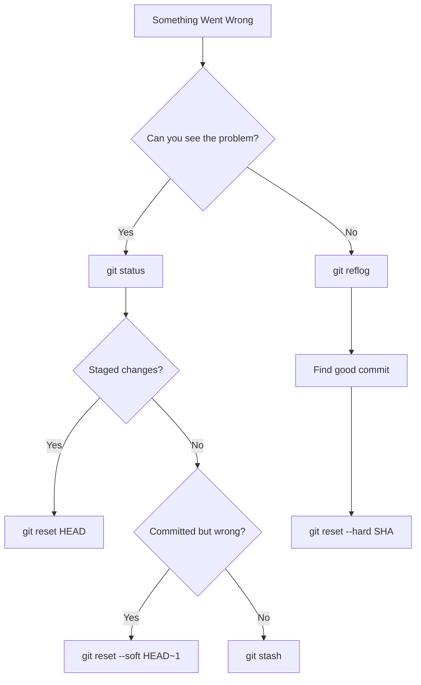

# Week 1: Foundation Week - Professional Development Environment

> **Learning Objective**: Transform from casual coder to professional developer with industry-standard tools and workflows that multiply productivity and prevent common disasters.

## 🎯 Week Overview

Welcome to the Strategic Business Digitization System! This week we establish the foundation that will make everything else possible. By the end of this week, you'll have a development environment that would impress any hiring manager and Git skills that prevent the disasters that derail most projects.

### Why This Week Matters

- **Productivity Multiplier**: Proper setup saves 2-3 hours per week throughout the course
- **Professional Credibility**: Employers immediately notice developers with professional workflows
- **Disaster Prevention**: Git mastery prevents losing weeks of work to common mistakes
- **Collaboration Ready**: Essential skills for any team development environment

---

## 📚 Day 1: Development Environment Setup

### Morning Session: IDE Configuration

#### VS Code Installation & Extensions

Follow our comprehensive [Developer Environment Setup Guide](../docs/DEV-ENVIRONMENT-SETUP.md) to install:

**Essential Extensions:**

- GitHub Copilot (AI assistance)
- GitLens (Git visualization)
- Prettier (Code formatting)
- Live Server (Local development)
- Markdown All in One (Documentation)

#### Magic Word: **Extension Ecosystem**

> Extensions transform VS Code from a text editor into a specialized development environment. Each extension adds capabilities that professional developers rely on daily.

```magic-word
Extension Ecosystem: A curated collection of VS Code extensions that work together to create a specialized development environment optimized for specific workflows and technologies.
```

#### AI Prompt: Environment Setup Assistant

```prompt
I'm setting up a professional web development environment in VS Code for a business digitization course. I need extensions for:
- AI-assisted coding
- Git visualization and management
- Markdown documentation
- Live preview and testing
- Code formatting and quality

Can you recommend specific extensions and explain how each one contributes to a professional workflow? Also suggest optimal settings for team collaboration.
```

### Afternoon Session: Git Installation & Configuration

#### Git Global Configuration

Set up your professional Git identity:

```bash
git config --global user.name "Your Professional Name"
git config --global user.email "your.professional@email.com"
git config --global init.defaultBranch main
git config --global color.ui auto
git config --global core.editor "code --wait"
```

#### Professional Git Aliases

Install time-saving aliases:

```bash
# Status and branch shortcuts
git config --global alias.st status
git config --global alias.br branch
git config --global alias.co checkout

# Commit shortcuts
git config --global alias.cm "commit -m"
git config --global alias.ca "commit -am"

# Advanced workflows for AI development
git config --global alias.save "!git add -A && git commit -m 'WIP: save current work'"
git config --global alias.undo "reset HEAD~1 --mixed"
```

### Day 1 Assignment: Environment Verification

1. Complete VS Code setup with all extensions
2. Configure Git with professional settings
3. Create test repository and make first commit
4. Screenshot your configured environment

---

## 📚 Day 2: Git Fundamentals for AI Development

### Morning Session: Basic Git Workflow

#### Magic Word: **Atomic Commits**

> Each commit should represent one logical change that can be described in a single sentence. This makes code history readable and enables precise rollbacks.

```magic-word
Atomic Commits: Version control practice where each commit contains exactly one logical change, making the project history clean, understandable, and easy to navigate or revert.
```

#### The Professional Commit Cycle

```bash
# 1. Check current state
git status

# 2. Stage specific changes (not just "git add .")
git add src/components/Header.js

# 3. Commit with descriptive message
git commit -m "feat: add responsive header component

- Implements mobile-first design approach
- Uses CSS Grid for flexible layout
- Includes ARIA labels for accessibility"

# 4. Push regularly to backup work
git push origin main
```

#### AI Prompt: Commit Message Generator

```prompt
I made changes to a web component that adds a responsive header to my website. The changes include:
- Mobile-first CSS design
- CSS Grid layout system
- Accessibility improvements with ARIA labels
- Integration with existing design system

Generate a professional commit message following conventional commit format that clearly explains what was changed and why it matters for the project.
```

### Afternoon Session: Git Safety Patterns

#### The Stash Workflow

```bash
# Need to switch contexts quickly?
git stash push -m "WIP: header responsive fixes in progress"

# Work on something else
git checkout -b hotfix/urgent-bug
# Make fixes, commit, push

# Return to original work
git checkout main
git stash pop
```

#### Magic Word: **Merge Conflicts**

> When Git can't automatically combine changes from different sources, requiring manual resolution to decide which changes to keep.

```magic-word
Merge Conflicts: Situations where Git cannot automatically combine changes from different branches or contributors, requiring manual resolution to determine which version of conflicting code to keep.
```

### Day 2 Assignment: Git Scenario Practice

1. Create feature branch with 3 atomic commits
2. Practice stash workflow with context switching
3. Simulate and resolve a merge conflict
4. Document your Git workflow in markdown

---

## 📚 Day 3: Professional Development Practices

### Morning Session: Quality Standards

#### Code Review Checklist

Before each commit, verify:

- [ ] Code builds without errors
- [ ] Changes are focused and atomic
- [ ] Commit message follows convention
- [ ] No sensitive data included
- [ ] Documentation updated if needed

#### Magic Word: **Conventional Commits**

> Standardized commit message format that makes project history readable by humans and parseable by tools for automation.

```magic-word
Conventional Commits: A specification for adding human and machine readable meaning to commit messages, enabling automated changelog generation and semantic versioning.
```

#### AI Prompt: Code Quality Reviewer

```prompt
I'm about to commit code changes to my project. Please review this checklist and suggest additional quality checks for professional web development:

Current checklist:
- Code builds without errors
- Atomic, focused changes
- Conventional commit message
- No sensitive data
- Updated documentation

What other quality standards should I check before committing? Consider security, performance, accessibility, and maintainability.
```

### Afternoon Session: Collaboration Workflows

#### Branch Naming Conventions

```
feature/user-authentication
fix/mobile-nav-bug
docs/api-documentation
style/golden-ratio-design
refactor/component-structure
hotfix/security-patch
```

#### Pull Request Template

```markdown
## Description

Brief description of changes and motivation

## Type of Change

- [ ] Bug fix (non-breaking change)
- [ ] New feature (non-breaking change)
- [ ] Breaking change (fix or feature that would cause existing functionality to not work as expected)
- [ ] Documentation update

## Testing

- [ ] Tests pass locally
- [ ] Manual testing completed
- [ ] Cross-browser testing (if applicable)

## Checklist

- [ ] Code follows style guidelines
- [ ] Self-review completed
- [ ] Documentation updated
- [ ] No merge conflicts
```

### Day 3 Assignment: Professional Workflow

1. Create feature branch with proper naming
2. Make 3 commits following all quality standards
3. Create pull request with professional description
4. Review classmate's pull request

---

## 📚 Day 4: Git Crisis Management

### Morning Session: Recovery Techniques

#### The "Oh No, I Broke Everything" Flowchart



#### Magic Word: **Git Reflog**

> Complete history of every action taken in your repository, including deleted commits, providing a safety net for recovery operations.

```magic-word
Git Reflog: A record of when the tips of branches and other references were updated in the local repository, allowing recovery of seemingly lost commits and branches.
```

#### Recovery Scenarios Practice

**Scenario 1: Wrong Commit Message**

```bash
# Committed with typo in message
git commit --amend -m "feat: add correct header component"
```

**Scenario 2: Committed Too Early**

```bash
# Need to add more changes to last commit
git add forgotten-file.js
git commit --amend --no-edit
```

**Scenario 3: Committed to Wrong Branch**

```bash
# Move commits to correct branch
git log --oneline -3  # Note the SHA
git reset --hard HEAD~3  # Remove from current branch
git checkout correct-branch
git cherry-pick SHA1 SHA2 SHA3  # Add to correct branch
```

#### AI Prompt: Git Crisis Consultant

```prompt
I'm in a Git crisis! Here's what happened:

[Describe your specific situation]

I need step-by-step recovery instructions that:
1. Minimize data loss
2. Maintain clean project history
3. Don't break anything else
4. Follow professional best practices

Please provide the exact commands and explain what each one does so I can learn from this mistake.
```

### Afternoon Session: Advanced Workflows

#### Interactive Rebase for History Cleanup

```bash
# Clean up last 3 commits before pushing
git rebase -i HEAD~3

# In the editor:
# pick = keep commit as-is
# squash = combine with previous commit
# reword = change commit message
# edit = modify commit content
```

#### Magic Word: **Interactive Rebase**

> Git feature that allows rewriting commit history by combining, editing, or reordering commits before sharing them with others.

```magic-word
Interactive Rebase: Git command that opens an editor allowing you to modify commit history by reordering, combining, editing, or removing commits before they are shared publicly.
```

### Day 4 Assignment: Crisis Simulation

1. Create intentional Git "disasters"
2. Practice recovery techniques
3. Document your recovery process
4. Help classmate with their crisis scenario

---

## 📚 Day 5: Integration & Portfolio Building

### Morning Session: Workflow Integration

#### Daily Developer Routine

```bash
# Start of day
git status
git pull origin main

# Before starting new work
git checkout -b feature/descriptive-name

# During development
git add specific-files
git commit -m "conventional: description"

# End of day (even if incomplete)
git push origin feature-branch

# When feature is complete
# Create pull request
# Code review
# Merge to main
```

#### AI Prompt: Workflow Optimizer

```prompt
I'm establishing a daily Git workflow for professional web development with AI assistance. My current routine is:

[Describe your current workflow]

How can I optimize this workflow for:
- Productivity and speed
- Collaboration with team members
- Code quality and safety
- Professional portfolio building
- AI-assisted development scenarios

Suggest improvements and explain the benefits of each change.
```

### Afternoon Session: Portfolio Setup

#### Professional Repository Structure

```
your-name/
├── README.md (Professional profile)
├── portfolio-projects/
│   ├── legs-course-work/
│   ├── personal-website/
│   └── business-projects/
├── learning-journey/
│   ├── weekly-reflections/
│   └── skill-progressions/
└── open-source-contributions/
```

#### Magic Word: **Git Portfolio**

> Your Git history becomes a professional portfolio demonstrating consistent work habits, code quality, and learning progression to potential employers.

```magic-word
Git Portfolio: The collective record of your commits, repositories, and contribution patterns that serves as evidence of your development skills, work habits, and professional growth.
```

### Day 5 Assignment: Portfolio Foundation

1. Create professional portfolio repository
2. Write compelling README with your learning goals
3. Set up weekly reflection documentation system
4. Make first portfolio commit with proper formatting

---

## 🎯 Week 1 Deliverables

### Required Submissions

1. **Environment Screenshot**: Configured VS Code with all extensions
2. **Git Configuration Export**: Your global Git settings
3. **Practice Repository**: Demonstrating all Git workflows learned
4. **Professional Portfolio**: Initial setup with first commits
5. **Reflection Document**: What you learned and how it applies

### Success Metrics

- [ ] VS Code configured with all required extensions
- [ ] Git installed with professional configuration
- [ ] Successfully completed 10+ professional commits
- [ ] Resolved at least one simulated merge conflict
- [ ] Created feature branch and pull request
- [ ] Portfolio repository established

---

## 🧠 Key Takeaways

### Magic Words Mastered This Week

- **Atomic Commits**: One logical change per commit
- **Conventional Commits**: Standardized message format
- **Merge Conflicts**: When Git needs human decision-making
- **Git Reflog**: Complete action history for recovery
- **Interactive Rebase**: History editing before sharing
- **Git Portfolio**: Professional demonstration of skills

### Professional Skills Gained

- Development environment identical to industry standards
- Git workflows that prevent common disasters
- Collaboration practices for team development
- Crisis recovery techniques for when things go wrong
- Portfolio building for career advancement

### AI Integration Insights

- How to manage AI-generated code professionally
- Git workflows optimized for experimental development
- Professional commit practices for AI-assisted projects
- Recovery techniques when AI suggestions go wrong

---

## 📈 Preparing for Week 2

Next week we begin building our AI prompt library and implementing the curriculum content system. Your professional Git workflow will become essential as we start managing more complex projects with multiple collaborators.

### Preview: Week 2 Focus Areas

- AI prompt engineering fundamentals
- Markdown-driven content management
- First business psychology concepts
- Collaborative development practices

---

## 🆘 Getting Help

### Common Issues This Week

- VS Code extensions not loading → Restart and check internet connection
- Git authentication problems → Set up SSH keys or credential manager
- Merge conflicts seem impossible → Use VS Code's built-in resolver
- Lost work in Git → Check `git reflog` before panicking

### Resources

- [Official Git Documentation](https://git-scm.com/doc)
- [VS Code Extension Marketplace](https://marketplace.visualstudio.com/)
- [Conventional Commits Specification](https://conventionalcommits.org/)
- Course Discord channel: #week-1-foundation

---

_Estimated Time Investment: 12 hours total_  
_Daily Commitment: 2-3 hours_  
_Difficulty Level: Foundation (Essential for all future work)_
